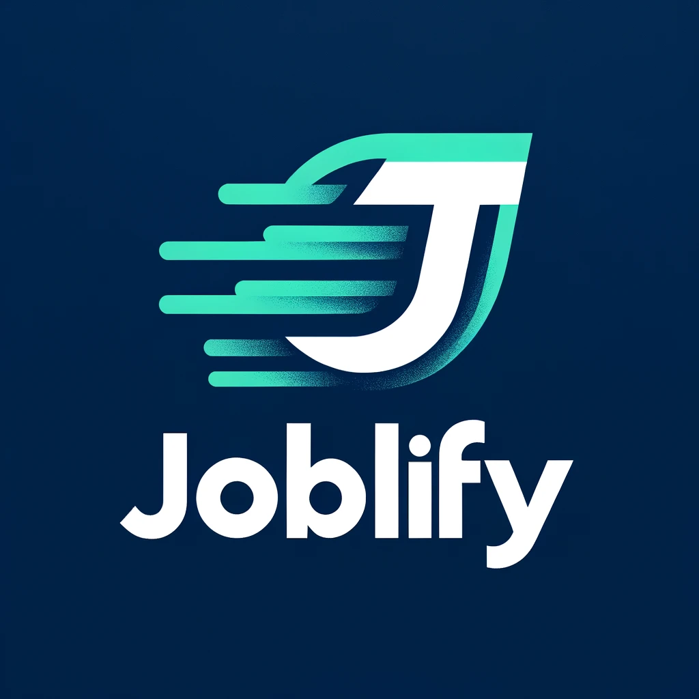

 

  

<h1 align="center">
    Winner of "Best AI Application Built with Cloudflare" at ConUHacks 🏆
    
</h1>

## About The Project

Joblify is an innovative application that takes a resume as input, parses it, and then generates a radar graph of your skills. It provides a unique, visual representation of your abilities. Additionally, Joblify features an AI chatbot that users can interact with to ask questions related to their resume and skills. The chatbot, having access to your resume, can provide personalized responses and insights.

### Screenshots

  

  

### Built With
- JavaScript
- React
- Express.Js
- Cloudflare Workers AI

(<a href="#readme-top">back to top</a>)

